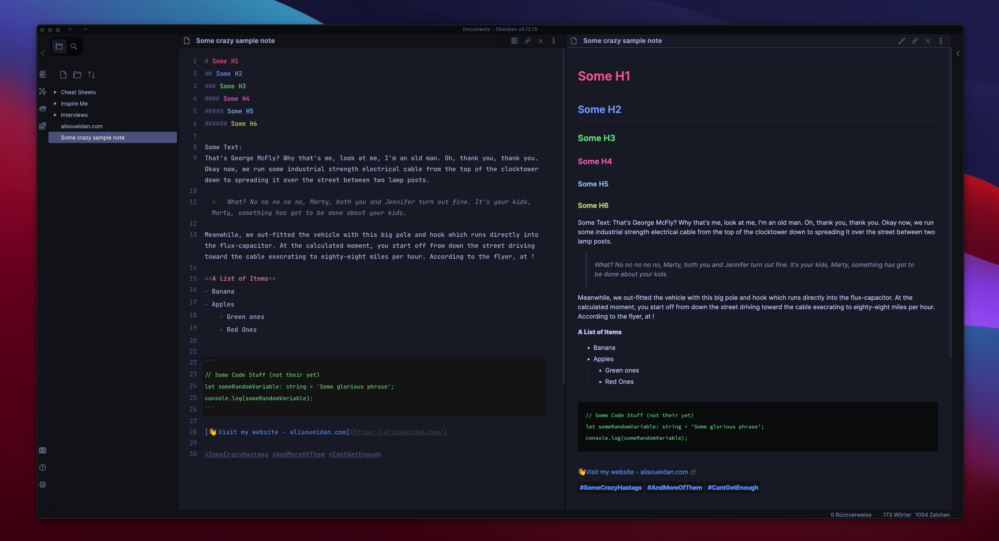

# Firefly Obsidian Theme

Firefly Theme is a dark theme for [Obsidian](https://obsidian.md/) in the making. The template a provides clean UI and decent color accents.

I took inspiration from some other themes (see credits), with the goal of creating an Obsidian theme that has more of the look and feel of a code editor in editor mode, and relies on more extended text formatting in preview mode, to deliver more of a blog ux. 

## Version Note
This is the first version of the Theme, and some stuff may not be implemented yet - it works for me for now. If you miss something feel free to get in touch or even participate if you like.

## How-To implement the Theme into Obsidian
1. Download `Firefly.css`from the this repo.
2. Place this in the root of your Obsidian notes directory.
3. Open the Settings in Obsidian
4. Navigate to Appearances tab under Options, also Ensure that the 'Base mode' setting is set to `Dark mode` and that 'Custom CSS' is turned on.
5. Under the Themes section, click on the dropdown menu next to Theme heading
6. Select for Firefly and then you're done! 🎉

## Fonts
This theme uses the [Inter](https://rsms.me/inter/) and [JetBrains Mono](https://jetbrains.com/mono) fonts. For the best experience, I recommend installing these fonts onto your local machine.

## Credits
This theme is inspired and more or less a mix of 
- [Tokyo Night Obsidian Theme, by Ruslan Gagushin](https://github.com/RuslanGagushin/Tokyo-Night-Obsidian-Theme)
- [Night Owl Theme, by Ben Hong](https://github.com/bencodezen/obsidian-night-owl-theme)
- [Clair de Lune Obsidian Theme, by Jamie Brynes](https://github.com/jamiebrynes7/clair-de-lune-obsidian-theme)

## License
This Theme is under CC0-1.0 License - so absolutely feel free to use, change, modify or share this theme! ✌️ 
