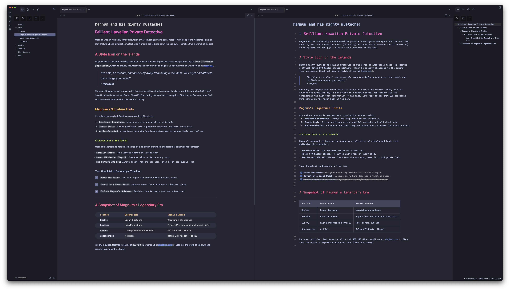
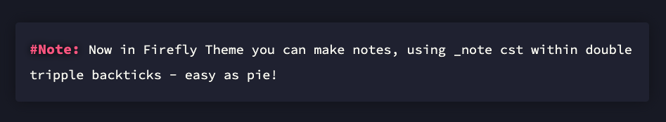

# ✨ Firefly Obsidian Theme (>13,800 Downloads ♥️)

## 📦 About this Version 


This is an early version of the **Firefly Theme** for [Obsidian](https://obsidian.md/). Some features may still be missing — but it works well for daily use.  
**If you're missing something, feel free to [open an issue](https://github.com/lazercaveman/firefly-obsidian-theme/issues)** to discuss ideas or request features.

---

## 📥 How to Install Firefly in Obsidian

### 🔁 Recommended: Through the Obsidian Marketplace
1. Open **Settings** in Obsidian
2. Go to **Appearance**
3. Under **Themes**, click **Browse**
4. Search for `Firefly`
5. Click **Use** and you're done! 🎉

### 🖐 Manual Installation
1. Download the `obsidian.css` file from this repository
2. Rename it to `Firefly.css` to ensure a unique name
3. Place it in your vault's `/.obsidian/themes/` directory
4. In Obsidian, go to **Settings → Appearance**
   - Set **Base mode** to `Dark mode`
   - Enable **Custom CSS**
5. Under **Themes**, select `Firefly` from the dropdown
6. Enjoy! 🎉

---

## ⚡ About Firefly
**Firefly** is a clean and minimal theme for Obsidian, designed to offer a focused writing environment with subtle color accents.  
It supports both **dark and light modes**, and provides slightly different styles for **edit** and **preview** modes to enhance readability and UX.



The goal was to combine the feel of a code editor in editing mode with a more refined, blog-like feel in reading mode.

---

## 🤖 Special Theme Features

### 🏷 Code-Style Tags (CST)
Firefly introduces an experimental feature called **code-style tags** (CSTs), which allow you to style content blocks using custom labels.

**Usage:**  
Like code blocks, CSTs begin with triple backticks, but instead of a language, use a tag like `_note`.

#### Example: `_note` CST  
Wrap content like this:

    ```_note
    This is a note block.
    ```

In preview mode, this renders as a styled note box with a drop shadow and a red `#Note` label.



This is still experimental — feedback welcome!

---

## 📓 Typography
This theme uses the beautiful [Inter](https://rsms.me/inter/) and [JetBrains Mono](https://jetbrains.com/mono) fonts.  
For best results, install them locally on your system.

---

## 👨‍💻 Contributing

Firefly is still evolving — and **you** can be part of shaping it!  
If you have ideas for new features, styling tweaks, or want to help implement missing parts: **pull requests are very welcome** 🙌

### Want to contribute?
- Fork the repository
- Create a feature branch
- Submit a PR with a short description

Let's build something awesome together!

---

## 🥳 Credits

Firefly was inspired by and blends elements of these amazing themes:

- 🎊 [Tokyo Night Theme – Ruslan Gagushin](https://github.com/RuslanGagushin/Tokyo-Night-Obsidian-Theme)
- 🎊 [Night Owl Theme – Ben Hong](https://github.com/bencodezen/obsidian-night-owl-theme)
- 🎊 [Clair de Lune – Jamie Brynes](https://github.com/jamiebrynes7/clair-de-lune-obsidian-theme)

---

## ✌️ License

This theme is released under the **CC0-1.0 License** — feel free to use, change, remix, or share without restrictions.

---

